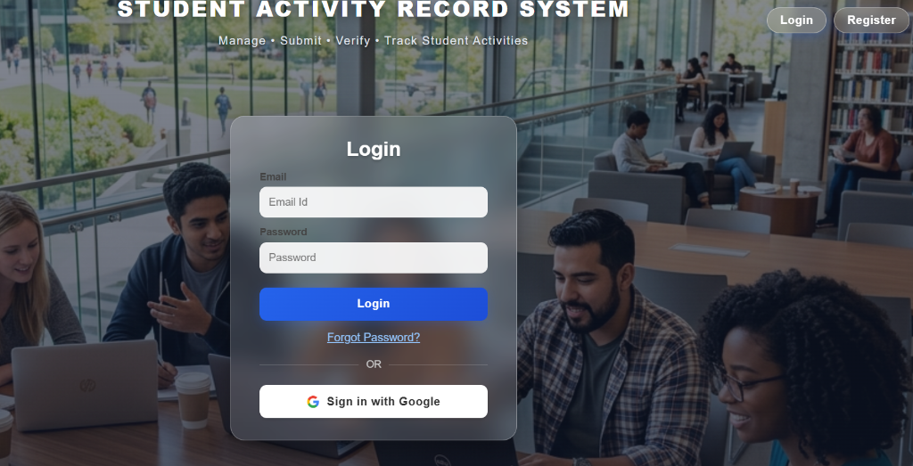
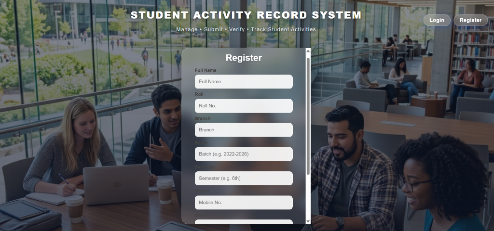
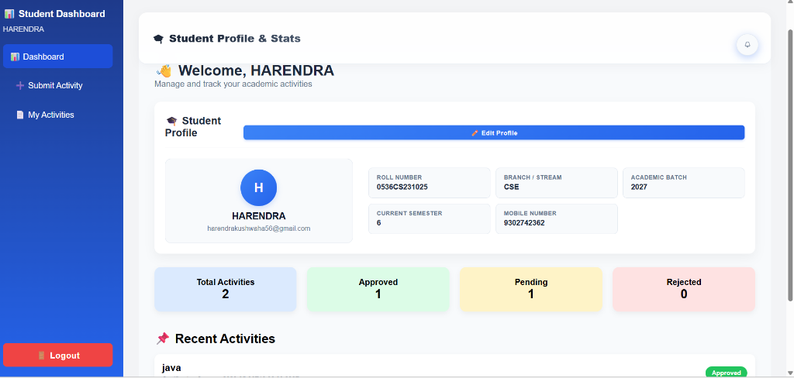
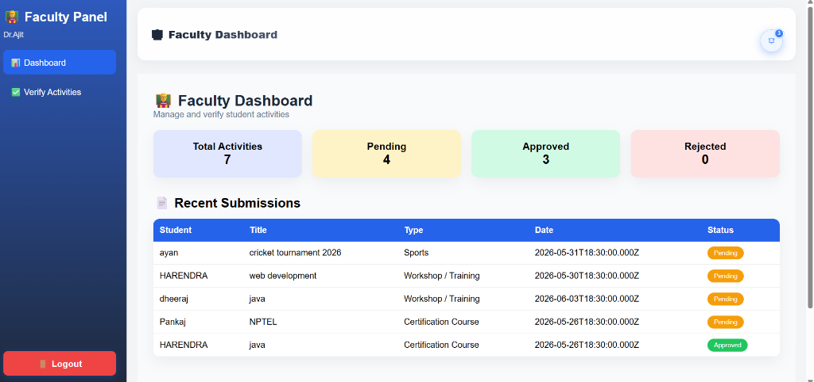
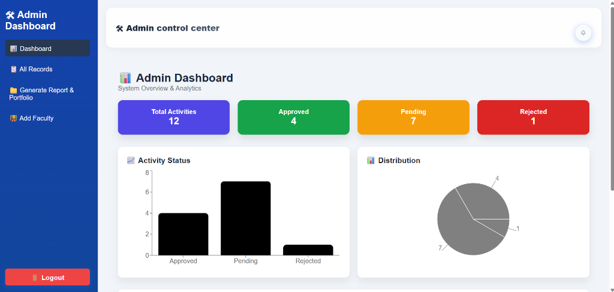
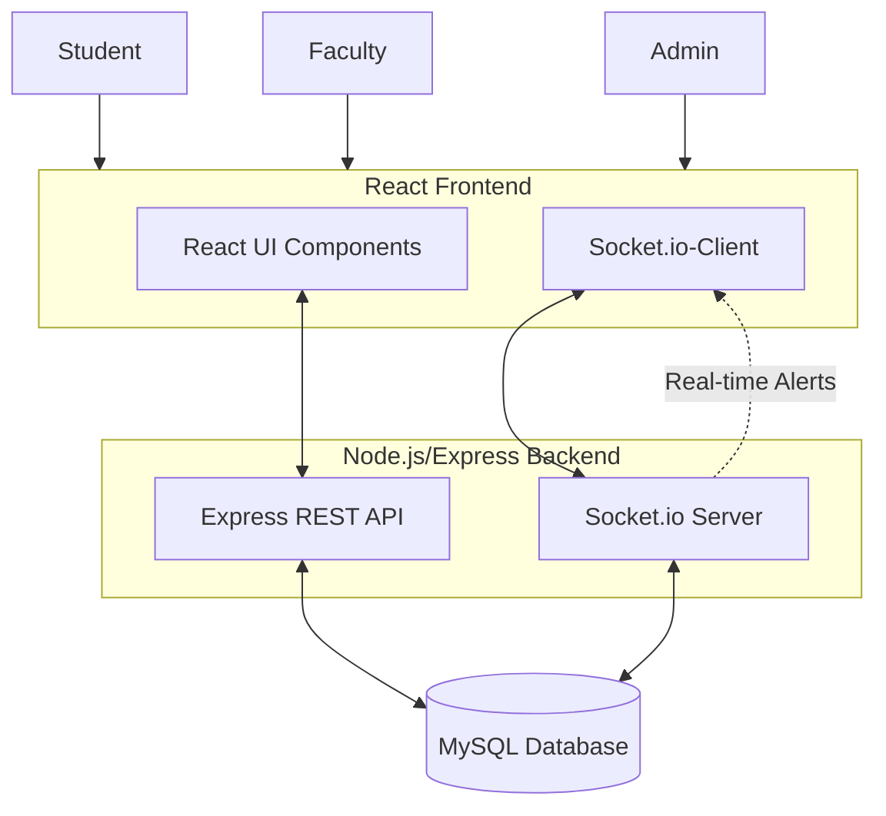
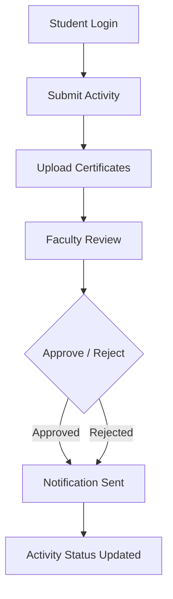

# 🎓 Student Activities Record System

An end-to-end, multi-role portal designed to streamline the management, submission, verification, and sharing of student co-curricular and extracurricular achievements. This system features real-time notifications via WebSockets, multi-file certificate uploads, automated portfolio generation, and QR-code-based public verification.

---

## 🌟 Key Features

### 👤 Student Portal
- **Dashboard Analytics:** Visual overview of all submitted, approved, pending, and rejected activities.
- **Activity Submission:** Submit achievements with detailed metadata including title, category, date, organization/organizer, participation mode, position/rank achieved, and reference links.
- **Multi-File Certificate Upload:** Attach multiple images or PDF certificates to serve as verification proof.
- **Activity Life Cycle:** Students can edit their activities at any time. Any update automatically resets the status to `Pending` and alerts the branch faculty.
- **Profile Management:** Keep academic details (branch, batch, roll, mobile, semester) up-to-date.

### 👨‍🏫 Faculty Portal
- **Branch-Specific View:** Faculty members only see and manage submissions from students belonging to their respective academic branch.
- **Activity Auditing & Verification:** Verify students' submissions with options to Approve or Reject, along with adding customized feedback remarks.
- **Real-Time Alerts:** Receive instant notifications when a student submits a new activity or updates an existing one.

### 🔑 Admin Portal
- **System Overview:** Access master statistics and analytics across all departments.
- **Faculty Management:** Complete CRUD capabilities (Create, Read, Update, Delete) for managing faculty members.
- **Student Database:** Search, filter, and view academic records and submissions for all registered students.
- **Portfolio Generator:** Compile a professional digital portfolio of approved student achievements.
- **Official Reports:** Generate comprehensive PDF-friendly reports showing student metrics, faculty remarks, and embedded certificates.
- **Verification QR Code:** Embeds a unique verification QR code in portfolios for external authenticators.

### 🔔 Real-Time & Persistent Notifications
- Powered by **Socket.io** for instant frontend-backend synchronization.
- **Automated Alerts:**
  - Faculty is notified when a student submits or updates an activity.
  - Students are notified when their activity status is updated by faculty.
  - Admins are notified when faculty approves or rejects an activity.
- **Persistence:** Notifications are saved in a MySQL table, allowing users to view read/unread logs upon logging in.

### 🌐 Public Portfolio Verification
- Secure base64 email-encoded token links generated for student portfolios.
- Third-party companies or institutions can scan the QR code or visit the link to instantly verify the authenticity of a student's approved achievements.

---

## 🛠️ Technology Stack

| Layer | Technologies Used |
|---|---|
| **Frontend** | React (Vite), React Router v7, Lucide Icons, Recharts, Socket.io-Client, Vanilla CSS |
| **Backend** | Node.js, Express, Socket.io, Multer (File Upload Handling), BcryptJS (Password Hashing) |
| **Database** | MySQL (with connection pooling via `mysql2`) |
| **Process Control** | Concurrently (running client & server together), Nodemon (live backend reload) |

---

## 📁 Project Structure

```text
student-activities-record-system/
├── client/                 # React Frontend (Vite)
│   ├── public/             # Static public assets
│   ├── src/
│   │   ├── assets/         # App styles and images
│   │   ├── components/     # Header, Sidebar, Shared UI elements
│   │   ├── pages/          # Student, Faculty, Admin dashboards & views
│   │   ├── AuthPage.jsx    # Authentication & client-side routes
│   │   ├── main.jsx        # App entry point
│   │   └── socket.js       # WebSocket initialization
│   ├── package.json
│   └── vite.config.js
│
├── server/                 # Express Backend (Node.js)
│   ├── uploads/            # Multer uploads destination (git-ignored)
│   ├── db.js               # MySQL Connection Pool
│   ├── server.js           # API Endpoints, WebSockets, and Middleware
│   └── package.json
│
├── package.json            # Root configuration for Concurrently
└── README.md
```

---

## 🗄️ Database Schema Setup

To set up the MySQL database, create a database named `record_db` and run the following SQL scripts to set up the tables:

### 1. User Table
```sql
CREATE TABLE IF NOT EXISTS user (
  id INT AUTO_INCREMENT PRIMARY KEY,
  name VARCHAR(100) NOT NULL,
  roll VARCHAR(50) DEFAULT NULL,
  email VARCHAR(100) NOT NULL UNIQUE,
  password VARCHAR(255) NOT NULL,
  role VARCHAR(20) NOT NULL, -- 'student', 'faculty', 'admin'
  branch VARCHAR(50) DEFAULT NULL,
  batch VARCHAR(50) DEFAULT NULL,
  mobile VARCHAR(15) DEFAULT NULL,
  facultyId VARCHAR(50) DEFAULT NULL,
  adminCode VARCHAR(50) DEFAULT NULL,
  semester VARCHAR(20) DEFAULT NULL
);
```

### 2. Activities Table
```sql
CREATE TABLE IF NOT EXISTS activities (
  id INT AUTO_INCREMENT PRIMARY KEY,
  studentEmail VARCHAR(100) NOT NULL,
  studentName VARCHAR(100) NOT NULL,
  roll VARCHAR(50) NOT NULL,
  branch VARCHAR(50) NOT NULL,
  batch VARCHAR(50) NOT NULL,
  title VARCHAR(150) NOT NULL,
  type VARCHAR(50) NOT NULL, -- e.g., Hackathon, Internship, Cultural, etc.
  description TEXT NOT NULL,
  date DATE NOT NULL,
  organizer VARCHAR(100) DEFAULT NULL,
  mode VARCHAR(50) DEFAULT NULL, -- 'Online', 'Offline'
  position VARCHAR(50) DEFAULT NULL, -- e.g., '1st Place', 'Participant'
  proofLink TEXT DEFAULT NULL, -- Comma-separated list of upload paths or URLs
  status VARCHAR(20) DEFAULT 'Pending', -- 'Pending', 'Approved', 'Rejected'
  remarks TEXT DEFAULT NULL
);
```

### 3. Notifications Table
```sql
CREATE TABLE IF NOT EXISTS notifications (
  id INT AUTO_INCREMENT PRIMARY KEY,
  recipientEmail VARCHAR(100) NOT NULL,
  message TEXT NOT NULL,
  type VARCHAR(50) NOT NULL,
  isRead TINYINT(1) DEFAULT 0,
  createdAt TIMESTAMP DEFAULT CURRENT_TIMESTAMP
);
```

---

## 🚀 Setup & Installation

### Prerequisites
- Node.js installed (v16.x or higher recommended)
- MySQL Server running locally

### Installation Steps

1. **Clone & Navigate:**
   ```bash
   cd student-activities-record-system
   ```

2. **Configure Database Connection:**
   Open `server/db.js` and modify the MySQL credentials to match your local database settings:
   ```javascript
   const db = mysql.createPool({
     host: "localhost",
     user: "root",
     password: "YOUR_MYSQL_PASSWORD",
     database: "record_db",
     waitForConnections: true,
     connectionLimit: 10,
     queueLimit: 0
   });
   ```

3. **Install Dependencies:**
   Install required packages in the root, client, and server folders:
   ```bash
   # Install root tools (Concurrently & Nodemon)
   npm install

   # Install frontend dependencies
   cd client
   npm install
   cd ..

   # Install backend dependencies
   cd server
   npm install
   cd ..
   ```

---

## 🏃‍♂️ Running the System

You can run both the frontend React dev server and the backend Node/Express server concurrently using a single command from the root directory:

```bash
npm run dev
```

- **Frontend Application:** Running at [http://localhost:5173](http://localhost:5173)
- **Backend API Server:** Running at [http://localhost:5000](http://localhost:5000)

---

## 🔒 Security & Best Practices
- **Password Protection:** User passwords are encrypted using bcrypt hashing before database storage.
- **Upload Safety:** Certificate files are uploaded using unique timestamps to prevent file name collisions.
- **Access Control:** Client routes are protected via a `ProtectedRoute` component checking the active user context in LocalStorage.

---

## 📸 Screenshots

Here are the screenshots for the main layouts and pages implemented in this project:

### Authentication Page (Login)

[](./screenshots/auth_page.png)

### Authentication Page (Register)

[](./screenshots/auth_register.png)

### Student Dashboard

[](./screenshots/student_dashboard.png)

### Faculty Verification

[](./screenshots/faculty_verification.png)

### Admin Dashboard

[](./screenshots/admin_dashboard.png)

---

## 📊 System Architecture Diagram



---

## 🔄 Activity Management Workflow Diagram



---

## 👨‍💻 Authors

**Team Members:**
* **Dheeraj Kumar Kushwaha**
* **Anshul**
* **Karan**
* **Mayur**

**Course:** B.Tech Computer Science & Engineering  
**College:** Sagar Institute of Science, Technology and Research (SISTec-R), Bhopal
